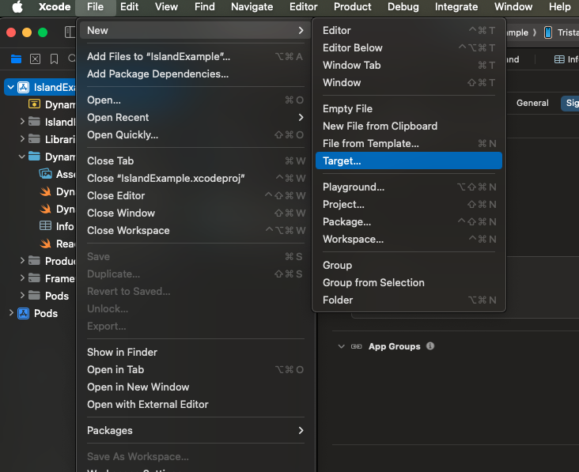
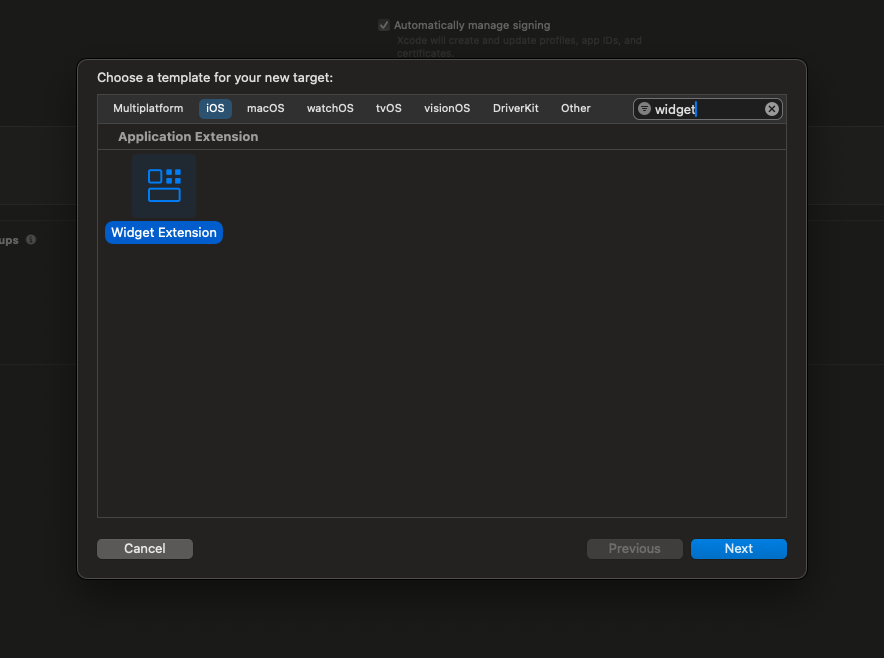
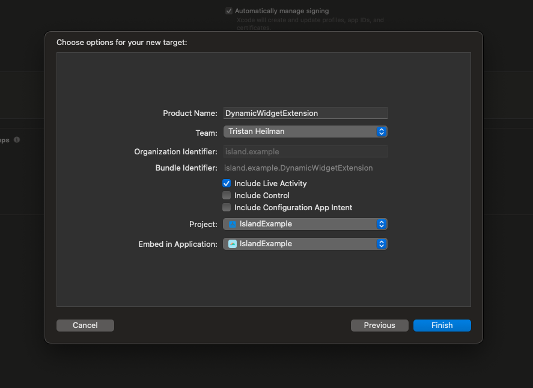
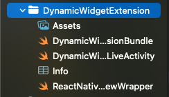

# Setup the DynamicWidgetExtension

1. Select your Project in Xcode and navigate to `File` -> `New` -> `Target`

    

2. Search for the `Widget Extention` and click Next

    

3. Name the widget `DynamicWidgetExtension` and select your team. Deselect the `Control` and `Configuration App Intent` include checkboxes.

    

4. Your widget should look similar to the example project. You will need to add the `ReactNativeViewWrapper.swift` file and adjust the `DynamicWidgetLiveActivity.swift` file.

    

    4a. Add a new swift file to your DynamicWidgetExtension named `ReactNativeViewWrapper.swift` and paste the below code into the file. [Copy Wrapper Swift File](../example/ios/DynamicWidgetExtension/ReactNativeViewWrapper.swift)

    **IMPORTANT**: Make sure to update the ReactNativeViewWrapper.swift file `PreRenderedComponentView` to utilize the correct app group string that you plan to utilize in step 5.

    4b. Replace the code in the `DynamicWidgetLiveActivity.swift` file. [Copy LiveActivity Swift File](../example/ios/DynamicWidgetExtension/DynamicWidgetExtensionLiveActivity.swift)

5. Add the `App Groups` capability to both the main project and the DynamicWidgetExtension and create a new app group.

    
