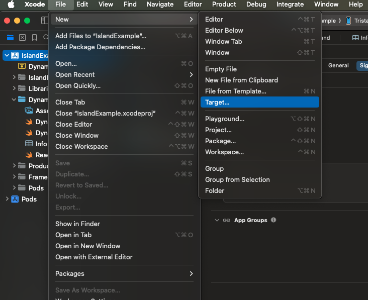
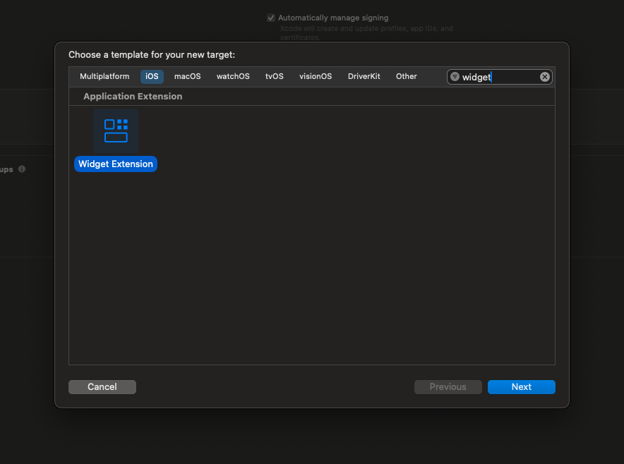
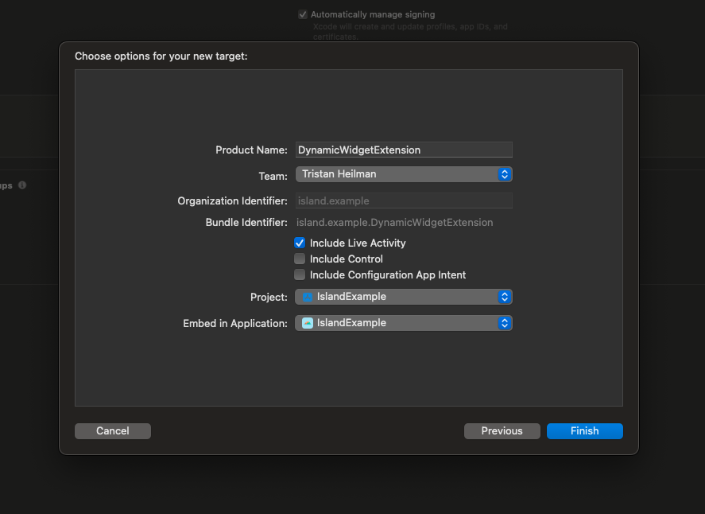
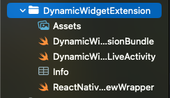

# Setup the DynamicWidgetExtension

1. Select your Project in Xcode and navigate to `File` -> `New` -> `Target`

    

2. Search for the `Widget Extention` and click Next

    

3. Name the widget `DynamicWidgetExtension` and select your team. Deselect the `Control` and `Configuration App Intent` include checkboxes.

    

4. Your widget should look similar to the example project. You will need to add the `ReactNativeViewWrapper.swift` file and adjust the `DynamicWidgetLiveActivity.swift` file.

    

    4a. Add a new swift file to your DynamicWidgetExtension named `ReactNativeViewWrapper.swift` and paste in the canonical template. [Copy Wrapper Swift File](../resources/ReactNativeViewWrapper.swift)

    **IMPORTANT**: Update the `APP_GROUP` constant at the top of `ReactNativeViewWrapper.swift` to the App Group string you create in step 5 (and pass to `setAppGroup(...)` from JavaScript).

    4b. Replace the code in the `DynamicWidgetExtensionLiveActivity.swift` file with the canonical template. [Copy LiveActivity Swift File](../resources/DynamicWidgetExtensionLiveActivity.swift)

    You can also copy `DynamicWidgetExtensionBundle.swift`. [Copy Bundle Swift File](../resources/DynamicWidgetExtensionBundle.swift)

    A complete, ready-to-reference version of all of these lives in [`example/ios/DynamicWidgetExtension`](../example/ios/DynamicWidgetExtension).

5. Add the `App Groups` capability to both the main project and the DynamicWidgetExtension and create a new app group.

    
